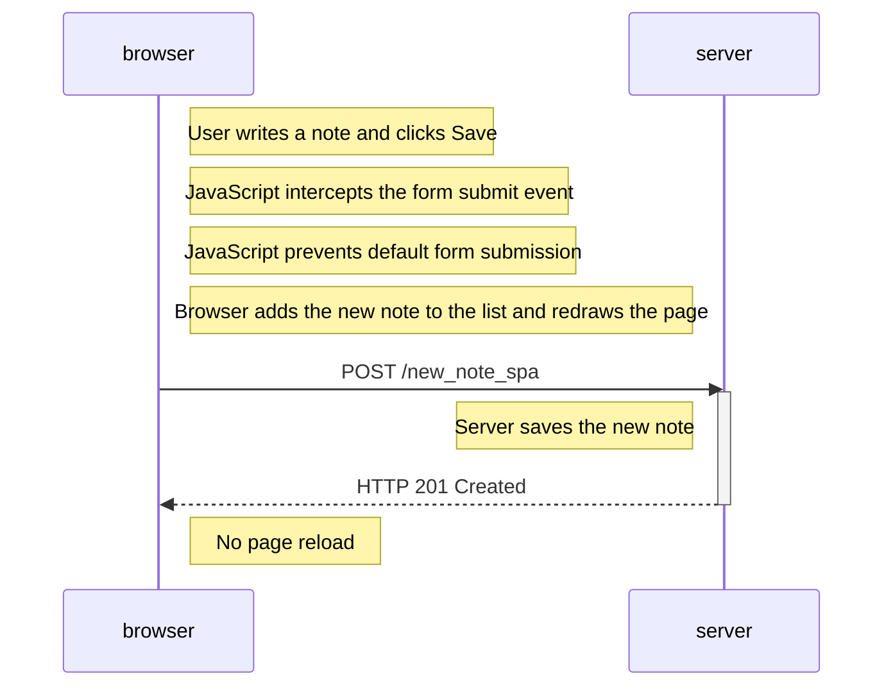

```mermaid
sequenceDiagram
    participant browser
    participant server

    Note right of browser: User writes a note and clicks Save
    Note right of browser: JavaScript intercepts the form submit event
    Note right of browser: JavaScript prevents default form submission
    Note right of browser: Browser adds the new note to the list and redraws the page

    browser->>server: POST /new_note_spa
    activate server
    Note left of server: Server saves the new note
    server-->>browser: HTTP 201 Created
    deactivate server

    Note right of browser: No page reload
```